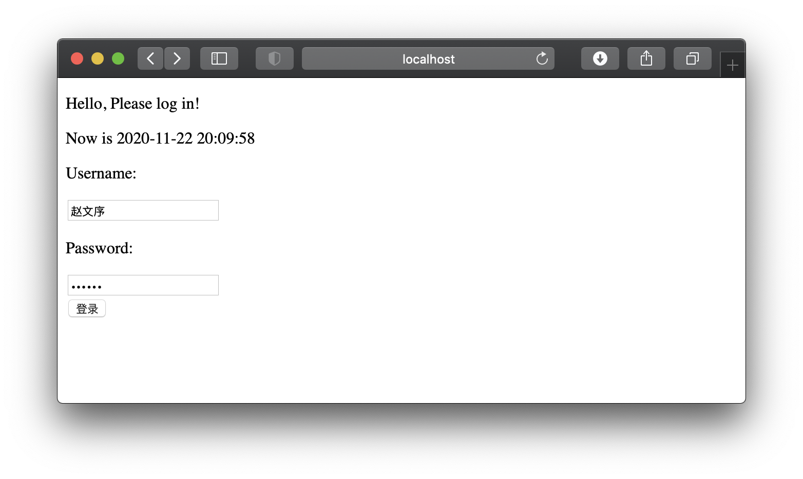
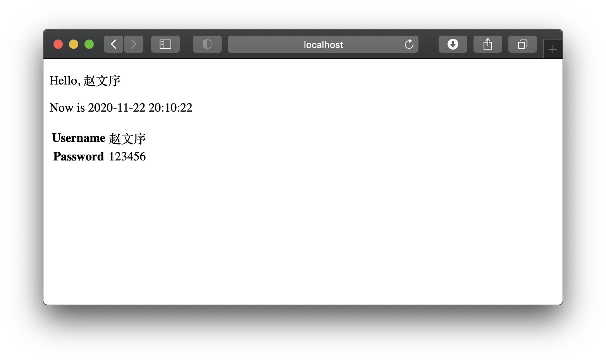
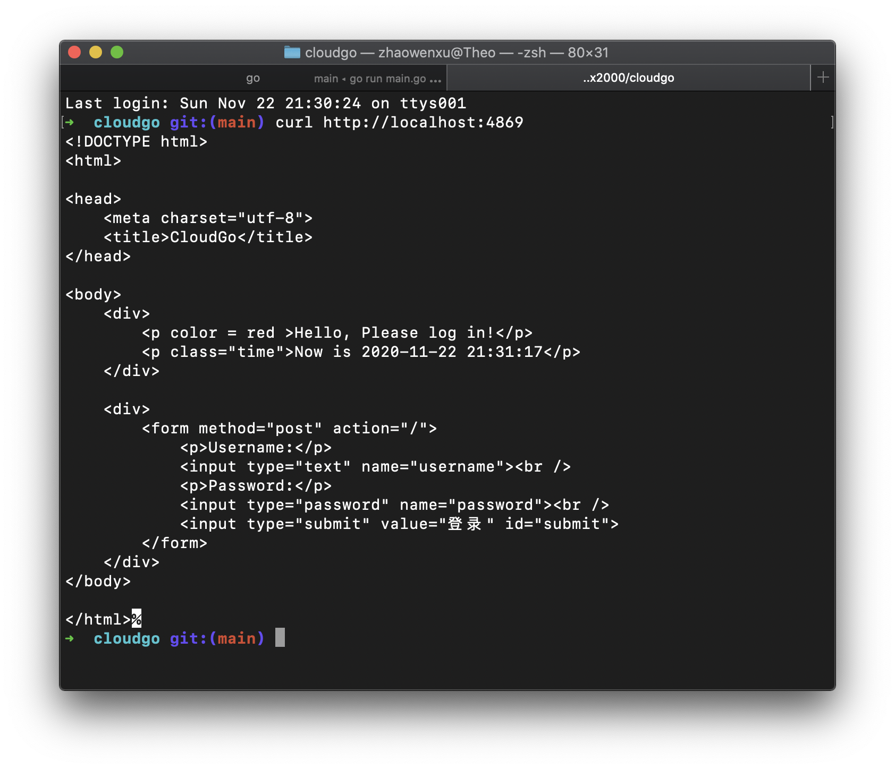
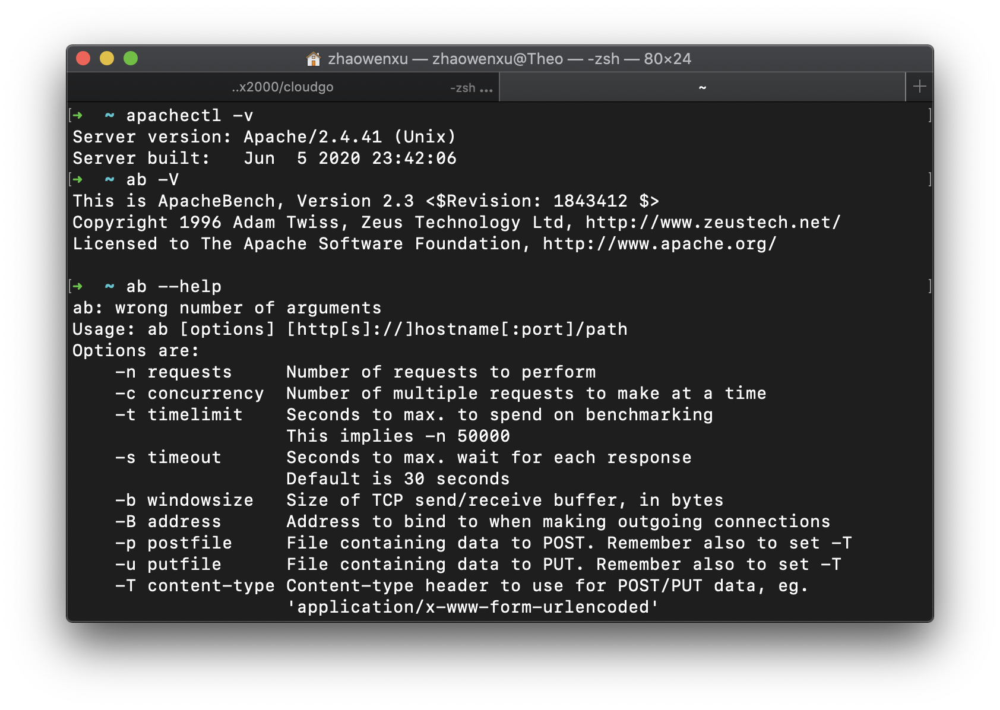

# cloudgo
> 开发简单 web 服务程序 cloudgo，了解 web 服务器工作原理
**任务目标**
- 熟悉 go 服务器工作原理
- 基于现有 web 库，编写一个简单 web 应用类似 cloudgo。
- 使用 curl 工具访问 web 程序
- 对 web 执行压力测试
## 实现结果
文件目录结构如下:
```
➜  cloudgo tree
.
|____server
| |____server.go
|____README.md
|____templates
| |____info.tmpl
| |____index.tmpl
|____resource
| |____login.gtpl
|____main.go
```

**安装方法**
在终端执行：
```
go get github.com/zwx2000/cloudgo
```
进入cloudgo目录
```
go run main.go
```
输出如下结果
```
➜  cloudgo go run main.go 
[martini] listening on :4869 (development)

```
在浏览器内输入`http://localhost:4869`

输入账户密码登陆

## curl测试

## ab测试
在这一方面占了mac OS系统的小便宜，已经预装了Web性能压力测试工具:ab(ApacheBench)
查询版本信息如下:


测试结果：
```
➜  cloudgo git:(main) ab -n 1000 -c 1000 http://localhost:4869/ 
This is ApacheBench, Version 2.3 <$Revision: 1843412 $>
Copyright 1996 Adam Twiss, Zeus Technology Ltd, http://www.zeustech.net/
Licensed to The Apache Software Foundation, http://www.apache.org/

Benchmarking localhost (be patient)
Completed 100 requests
Completed 200 requests
Completed 300 requests
Completed 400 requests
Completed 500 requests
Completed 600 requests
Completed 700 requests
Completed 800 requests
Completed 900 requests
Completed 1000 requests
Finished 1000 requests


Server Software:        
Server Hostname:        localhost
Server Port:            4869

Document Path:          /
Document Length:        552 bytes

Concurrency Level:      1000
Time taken for tests:   0.175 seconds
Complete requests:      1000
Failed requests:        0
Total transferred:      669000 bytes
HTML transferred:       552000 bytes
Requests per second:    5722.13 [#/sec] (mean)
Time per request:       174.760 [ms] (mean)
Time per request:       0.175 [ms] (mean, across all concurrent requests)
Transfer rate:          3738.39 [Kbytes/sec] received

Connection Times (ms)
              min  mean[+/-sd] median   max
Connect:        0   38  18.3     37      73
Processing:     6   67  26.8     72     100
Waiting:        1   66  27.2     71     100
Total:         23  105  27.7    108     170

Percentage of the requests served within a certain time (ms)
  50%    108
  66%    117
  75%    123
  80%    127
  90%    137
  95%    145
  98%    158
  99%    163
 100%    170 (longest request)
```

参数解释：
|参数|解释|
|:-|:-|
|Concurrency Level|并发数|
|Time taken for tests|完成所有请求总共花费的时间|
|Complete requests|成功请求的次数|
|Failed requests|失败请求的次数|
|Total transferred|总共传输的字节数|
|HTML transferred|实际页面传输的字节数|
|Requests per second|每秒请求数|
|Time per request: [ms] (mean)|平均每个用户等待的时间|
|Time per request: [ms] (mean, across all concurrent requests)|服务器处理的平均时间|
|Transfer rate|传输速率|